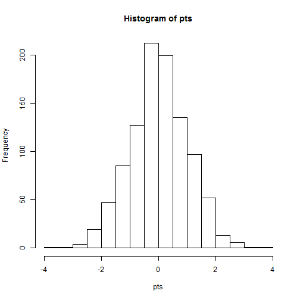
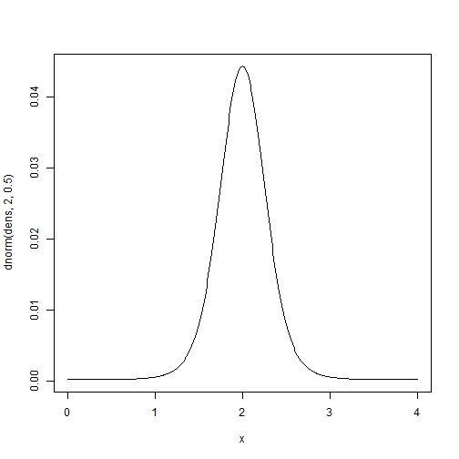

Probabilities and Distributions
================================

Generating random samples from a normal distribution

It is often very useful to be able to generate a sample from a specific distribution. To generate a sample of size 100 from a standard normal distribution (with mean 0 and standard deviation 1) we use the rnorm function. We only have to supply the n (sample size) argument since mean 0 and standard deviation 1 are the default values for the mean and stdev arguments.


```r
norm <- rnorm(100)
norm
```

```
##   [1]  0.196586 -0.110681  0.797108 -0.668288  0.739388 -0.035719 -1.569451
##   [8]  2.207760  2.199467  0.521023 -0.292680  0.649531 -0.056489  1.179443
##  [15]  0.138877  2.737091 -0.985313  0.317825 -0.073368 -0.557140 -0.034209
##  [22] -0.775303  1.064968  0.264040 -1.459477 -0.070681 -0.568060  1.412142
##  [29]  0.954566 -1.032554 -0.411034  0.687007  0.228441  0.042603 -0.902655
##  [36]  0.156936 -0.667672  0.206985  0.608406  0.511446 -2.356332  0.113570
##  [43]  1.467215 -0.008188  0.995612  1.162154 -0.265710  0.638652  0.659287
##  [50] -0.442589 -0.268794  0.412264  0.170900 -0.728219  0.821605  0.755927
##  [57] -0.720495 -0.437333 -0.665503  0.917829 -0.828550  0.453521 -0.698627
##  [64] -0.143023 -0.228888 -0.895484  2.943287 -0.023149 -0.325409 -1.002660
##  [71] -0.498811 -1.699497  0.851027 -1.121158  0.517580  0.538983 -1.679200
##  [78] -0.045286 -0.145989  0.947757  0.759899 -0.495219  0.093303  0.572279
##  [85]  0.351704  0.186352 -0.224975 -0.111701 -1.330995  0.088576  0.952108
##  [92]  0.349726  1.238222 -0.029774 -0.296338  0.299518 -0.678584 -0.372530
##  [99]  1.335492  1.898784
```


**Try It!**
------------
1. Look up the rnorm function in help screen, what are three arguments?
2. Draw 100 random numbers from a normal distribution with a mean of 3 and an sd of 2, assign it to an object "a"

3. Find the mean number if your draw, how close was it to the true mean
4. Using the ?? tool, lookup the function for standard deviation *Hint* the ?? tool should not include spaces in the query.
5. Drawing on what we learned last time, if "a" is a vector of 100 random normal draws, what is the syntax to get the 13th number in the vector?

Generating random samples from other distributions
----------------------------------------------------

R has many distributions in the base package, including all commonly used in biological analysis. Depending on the distribution, each function has its own set of parameter arguments. For example, the rpois function is the random number generator for the Poisson distribution and it has only the parameter argument lambda. The rbinom function is the random number generator for the binomial distribution and it takes two arguments: size and prob. The size argument specifies the number of Bernoulli trials and the prob argument specifies the probability of a success for each trial. 

For now, its sufficient to know that a possion distribution is commonly used for count data, and has only paramater lambda, which is both the expected mean and var

Generating a random sample from a Poisson distribution with lambda=3

**Try It!**
------------
6. Draw 100 values from a poisson with a lambda =3, assign it to an object a
7. Draw 1000 values from a poisson with a lambda, assign it to an object b
8. Find the means of both draws, what is the difference in means?

Other probability and distribution functions
--------------------------------------------
For each of the distributions there are four functions which will generate fundamental quantities of a distribution. Let's consider the normal distribution as an example. We have already given examples of the rnorm function which will generate a random sample from a specific normal distribution. The dnorm function will generate the density (or point) probability for a specific value for a normal distribution. This function is very useful for creating a plot of a density function of a distribution. In the list of the random number generator functions all the functions started with an "r", similarly the density functions for all the distributions all start with a "d".


**Try It!**
------------

9. What is the point probability for a -1.96 for a normal of mean =0, sd=1
10. We want to make a sequence of numbers, based on a given interval, look up, using ??sequence, and find the function that does this. *Hint* it is in the base package
11. Create a sequence beginning at 0 and ending at 4, with .2 intervals, save this as object x.

An introduction to plotting - Univariate
=====================================

Histograms are the most common univariate plot. Histograms place data into "bins", and count the number of data falling into each bin. Bins are usually plotted as bars, with the x range on the x axis, and count on the y axis.


```r
# Draw a thousand random normal points
pts <- rnorm(1000)
hist(pts)
```

 


Histograms are an effective way of visualizing distributions

**Try It!**
------------

12. Draw 10 random normal points and plot a histogram, then 100, then 1000, what do you notice about the plot?

13. Explore atleast one other distribution, look up ?distributions *Hint remember to use the r-nameofdistribution function to pull random samples

14. Plot your new distribution and compare with your neighbor.

15. Draw 1000 random normals with a mean of 0 and a sd of 1. Look at the hist help screen. How do you specify the size of the bin range? Try making bins from -4 to 4, with intervals of .01, .1, and 1. *Hint* Consider using the seq() in the "breaks"" argument within hist().


An introduction to plotting - Bivariate
=====================================

```r
x <- seq(0, 4, 0.01)
dens <- dnorm(x, 2, 0.5)
plot(x, dnorm(dens, 2, 0.5), type = "l")
```

 


The base package has an immense number of plotting tools, let's look at the plot help screen


**Try It!**
------------

16. Plot your density function. Label your axis, "This is the x axis", "This is the y axis"
17. Repeat the above seq, from 0 to 4, but make the interval .01, replot your figure, how is the plot changed?
