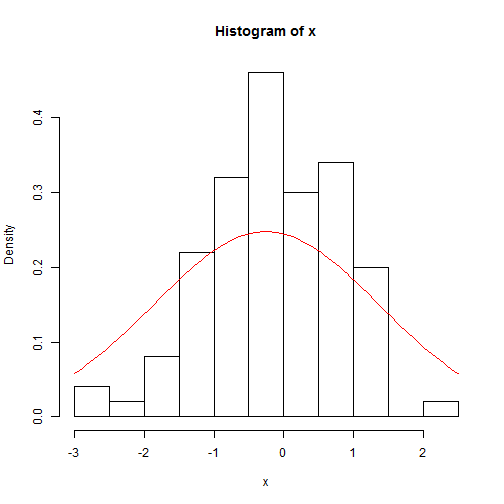

WorkSheet 2 - Distributions
========================================================

Understanding your data is a critical step in analysis. Describe in words the following data types. Is it numeric? Continious? Bounded at 0? 

Don't yet worry about the distributions, the point is to recognize fundamental characteristics of data.

Data Structure
-----------
> 1. Draw 1000 random normal points with mean of 0 and sd of 1

> 2. Draw 1000 random Poisson points lambda=1

> 3. Draw 1000 random binomial points with prob =.5 (coin flip,n=1)

Univariate Plotting
---------

> 4. Create a histogram of each distribution above.
> 5. Increase to just cut into 10 sections, see ?hist

Fitting Distributions
----------
Using Curve, fit a histogram of your data with a distribution curve

Following the example.


```r
x <- rnorm(100)
head(x)
```

```
## [1]  0.1684  0.8671  1.0718  1.2165 -0.3324 -0.3993
```

```r
hist(x, prob = TRUE)
curve(dnorm(x, mean = mean(x), sd = sd(x)), add = TRUE, col = "red")
```

 


What does the prob=TRUE argument do in histogram? Why is it needed?

> 6. Fit questions 2 and 3 to their respective distributions.
> 7. Plot all distributions together, using the add=TRUE parameters, please color them seperately and make not of which distribution is which color. 


