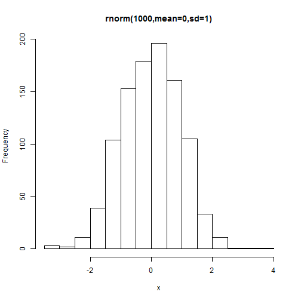
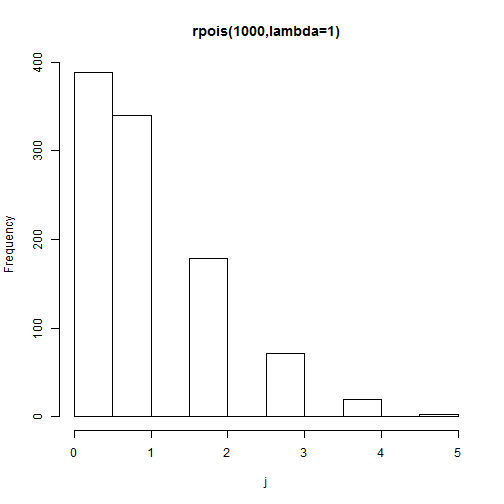
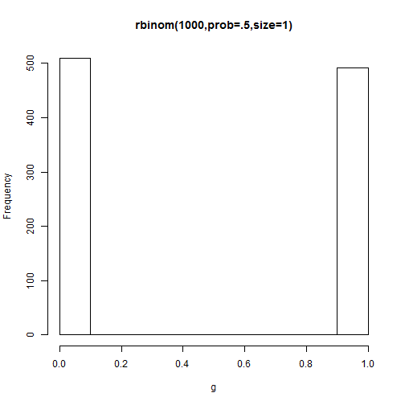
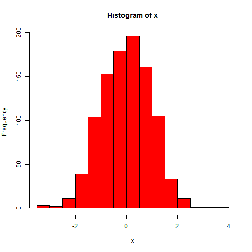
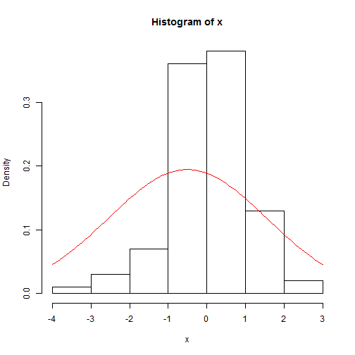
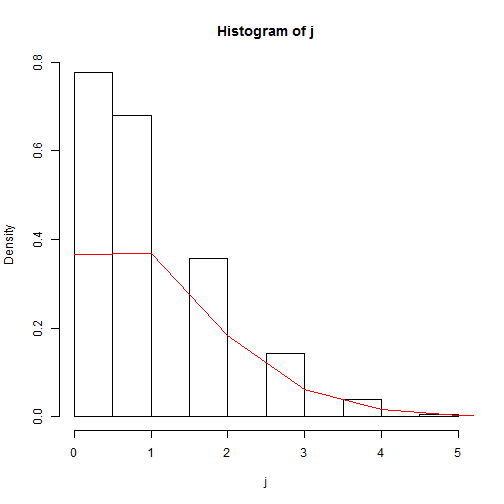
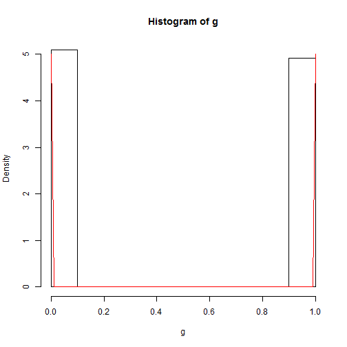
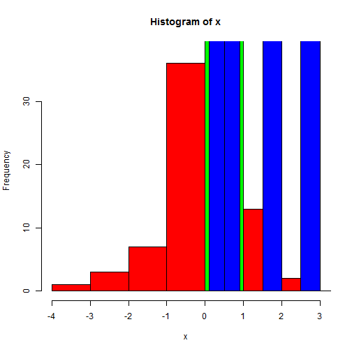

WorkSheet 2 - Distributions
========================================================

Understanding your data is a critical step in analysis. Describe in words the following data types. Is it numeric? Continious? Bounded at 0? 

Don't yet worry about the distributions, the point is to recognize fundamental characteristics of data.

Data Structure
-----------
> 1. Draw 1000 random normal points with mean of 0 and sd of 1


```r
x <- rnorm(1000, mean = 0, sd = 1)
head(x)
```

```
## [1]  0.6620  0.1180 -1.5360 -0.1358  0.2250  0.7439
```


> 2. Draw 1000 random Poisson points lambda=1


```r
j <- rpois(1000, lambda = 1)
head(j)
```

```
## [1] 3 0 0 0 0 1
```


> 3. Draw 1000 random binomial points with prob =.5 (coin flip; ie size=1)


```r
g <- rbinom(1000, prob = 0.5, size = 1)
head(g)
```

```
## [1] 0 1 0 1 1 1
```


Univariate Plotting
---------

> 4. Create a histogram of each distribution above.


```r
hist(x, main = "rnorm(1000,mean=0,sd=1)")
```

 

```r
hist(j, main = "rpois(1000,lambda=1)")
```

 

```r
hist(g, main = "rbinom(1000,prob=.5,size=1)")
```

 

``

> 5. Increase to just cut into 10 sections, see ?hist

```r
hist(x, col = "red", breaks = 10)
```

 


Fitting Distributions
----------
Using Curve, fit a histogram of your data with a distribution curve

Following the example.


```r
x <- rnorm(100)
head(x)
```

```
## [1] -1.8962  0.7391  1.9827 -0.6615 -0.6635 -1.3566
```

```r
hist(x, prob = TRUE)
curve(dnorm(x, mean = mean(x), sd = sd(x)), add = TRUE, col = "red")
```

 


What does the prob=TRUE argument do in histogram? Why is it needed?

> 6. Fit questions 2 and 3 to their respective distributions.


```r
hist(j, prob = TRUE)
curve(dpois(x, lambda = mean(j)), col = "red", from = 0, to = 6, n = 7, add = TRUE)
```

 


```r
# 
hist(g, probability = TRUE)
curve(dbinom(x, prob = 0.5, size = 1) * 10, col = "red", add = TRUE)
```

```
## Warning: non-integer x = 0.010000 Warning: non-integer x = 0.020000
## Warning: non-integer x = 0.030000 Warning: non-integer x = 0.040000
## Warning: non-integer x = 0.050000 Warning: non-integer x = 0.060000
## Warning: non-integer x = 0.070000 Warning: non-integer x = 0.080000
## Warning: non-integer x = 0.090000 Warning: non-integer x = 0.100000
## Warning: non-integer x = 0.110000 Warning: non-integer x = 0.120000
## Warning: non-integer x = 0.130000 Warning: non-integer x = 0.140000
## Warning: non-integer x = 0.150000 Warning: non-integer x = 0.160000
## Warning: non-integer x = 0.170000 Warning: non-integer x = 0.180000
## Warning: non-integer x = 0.190000 Warning: non-integer x = 0.200000
## Warning: non-integer x = 0.210000 Warning: non-integer x = 0.220000
## Warning: non-integer x = 0.230000 Warning: non-integer x = 0.240000
## Warning: non-integer x = 0.250000 Warning: non-integer x = 0.260000
## Warning: non-integer x = 0.270000 Warning: non-integer x = 0.280000
## Warning: non-integer x = 0.290000 Warning: non-integer x = 0.300000
## Warning: non-integer x = 0.310000 Warning: non-integer x = 0.320000
## Warning: non-integer x = 0.330000 Warning: non-integer x = 0.340000
## Warning: non-integer x = 0.350000 Warning: non-integer x = 0.360000
## Warning: non-integer x = 0.370000 Warning: non-integer x = 0.380000
## Warning: non-integer x = 0.390000 Warning: non-integer x = 0.400000
## Warning: non-integer x = 0.410000 Warning: non-integer x = 0.420000
## Warning: non-integer x = 0.430000 Warning: non-integer x = 0.440000
## Warning: non-integer x = 0.450000 Warning: non-integer x = 0.460000
## Warning: non-integer x = 0.470000 Warning: non-integer x = 0.480000
## Warning: non-integer x = 0.490000 Warning: non-integer x = 0.500000
## Warning: non-integer x = 0.510000 Warning: non-integer x = 0.520000
## Warning: non-integer x = 0.530000 Warning: non-integer x = 0.540000
## Warning: non-integer x = 0.550000 Warning: non-integer x = 0.560000
## Warning: non-integer x = 0.570000 Warning: non-integer x = 0.580000
## Warning: non-integer x = 0.590000 Warning: non-integer x = 0.600000
## Warning: non-integer x = 0.610000 Warning: non-integer x = 0.620000
## Warning: non-integer x = 0.630000 Warning: non-integer x = 0.640000
## Warning: non-integer x = 0.650000 Warning: non-integer x = 0.660000
## Warning: non-integer x = 0.670000 Warning: non-integer x = 0.680000
## Warning: non-integer x = 0.690000 Warning: non-integer x = 0.700000
## Warning: non-integer x = 0.710000 Warning: non-integer x = 0.720000
## Warning: non-integer x = 0.730000 Warning: non-integer x = 0.740000
## Warning: non-integer x = 0.750000 Warning: non-integer x = 0.760000
## Warning: non-integer x = 0.770000 Warning: non-integer x = 0.780000
## Warning: non-integer x = 0.790000 Warning: non-integer x = 0.800000
## Warning: non-integer x = 0.810000 Warning: non-integer x = 0.820000
## Warning: non-integer x = 0.830000 Warning: non-integer x = 0.840000
## Warning: non-integer x = 0.850000 Warning: non-integer x = 0.860000
## Warning: non-integer x = 0.870000 Warning: non-integer x = 0.880000
## Warning: non-integer x = 0.890000 Warning: non-integer x = 0.900000
## Warning: non-integer x = 0.910000 Warning: non-integer x = 0.920000
## Warning: non-integer x = 0.930000 Warning: non-integer x = 0.940000
## Warning: non-integer x = 0.950000 Warning: non-integer x = 0.960000
## Warning: non-integer x = 0.970000 Warning: non-integer x = 0.980000
## Warning: non-integer x = 0.990000
```

 

```r

# That's awkward, do you know why!
```


> 7. Plot all distributions together, using the add=TRUE parameters, please color them seperately and make not of which distribution is which color. 

Red is normal
Blue is poisson
Green is binomial


```r
# all at once,
hist(x, col = "red")
hist(j, col = "blue", add = TRUE)
hist(g, col = "green", add = TRUE)
```

 


