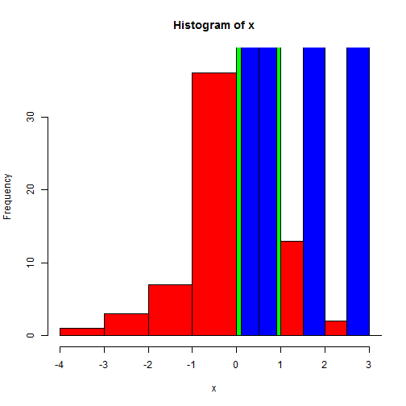

Worksheet 4 - Loops and Flow Statements 
======================================

In class we explored basic loop structures. Let's additionally important concepts.

Loops and Outputs
----------------

Often the hardest task is not the computation, but controlling the data structure of outputing the loop. Try these variants:


```r
require(ggplot2)
```

```
## Loading required package: ggplot2
```


> 1. Create a for loop from 1:100 that sticks x * 2 into a list


```r
j <- list()
for (x in 1:100) {
    j[[x]] <- x * 2
}
head(j)
```

```
## [[1]]
## [1] 2
## 
## [[2]]
## [1] 4
## 
## [[3]]
## [1] 6
## 
## [[4]]
## [1] 8
## 
## [[5]]
## [1] 10
## 
## [[6]]
## [1] 12
```


> 2. Create a for loop from 1:100 that sticks x * 2 into a vector


```r
j <- vector()

for (x in 1:100) {
    j[x] <- x * 2
}
head(j)
```

```
## [1]  2  4  6  8 10 12
```


> 3. Create a for loop from 1:100 that sticks x * 2 into a dataframe, with the first column as x. 


```r

j <- data.frame(X = 1:100, OUT = NA)

for (x in 1:100) {
    j[x, "OUT"] <- x * 2
}

head(j)
```

```
##   X OUT
## 1 1   2
## 2 2   4
## 3 3   6
## 4 4   8
## 5 5  10
## 6 6  12
```


> 4. Create a for loop that skips odd rows in the dataframe using next, don't cheat when using the seq statement iterator. Google if you need help! 


```r

j <- data.frame(X = 1:100, OUT = NA)

for (x in 1:100) {
    is.even <- function(x) x%%2 == 0
    if (!is.even(x)) {
        next
    }
    j[x, "OUT"] <- x * 2
}

head(j)
```

```
##   X OUT
## 1 1  NA
## 2 2   4
## 3 3  NA
## 4 4   8
## 5 5  NA
## 6 6  12
```


Using user defined functions within a loop.
===========================================
Here is a generic function for finding prime numbers, 

http://en.wikipedia.org/wiki/Sieve_of_Eratosthenes

*The function is a bit slow, so don't go too high!*


```r
sieve <- function(n) {
    n <- as.integer(n)
    if (n > 1e+06) 
        stop("n too large")
    primes <- rep(TRUE, n)
    primes[1] <- FALSE
    last.prime <- 2L
    for (i in last.prime:floor(sqrt(n))) {
        primes[seq.int(2L * last.prime, n, last.prime)] <- FALSE
        last.prime <- last.prime + min(which(primes[(last.prime + 1):n]))
    }
    which(primes)
}

# Test
paste(sieve(10), "is prime")
```

```
## [1] "2 is prime" "3 is prime" "5 is prime" "7 is prime"
```


> 5. How many prime numbers are below 50?


```r
length(sieve(50))
```

```
## [1] 15
```


> 6. How many prime numbers are below 50, but above 10?


```r
a <- sieve(50)
length(which(a > 10))
```

```
## [1] 11
```


Now for the loops.

> 8. Plot the number of prime numbers from 100 to 1000, by intervals of 100. 

```r

s <- seq(100, 1000, 100)
j <- data.frame(Size = s, NumberPrimes = NA)
for (x in s) {
    a <- sieve(x)
    j[which(x == s), "NumberPrimes"] <- length(a)
}

qplot(j$Size, j$NumberPrimes)
```

 


> 9. Break the loop when the number of primes is greater than 1000. 


```r
s <- seq(100, 1000, 100)
j <- data.frame(Size = s, NumberPrimes = NA)
for (x in s) {
    a <- sieve(x)
    j[which(x == s), "NumberPrimes"] <- length(a)
    if (length(a) > 1000) 
        break
}

qplot(j$Size, j$NumberPrimes)
```

 

